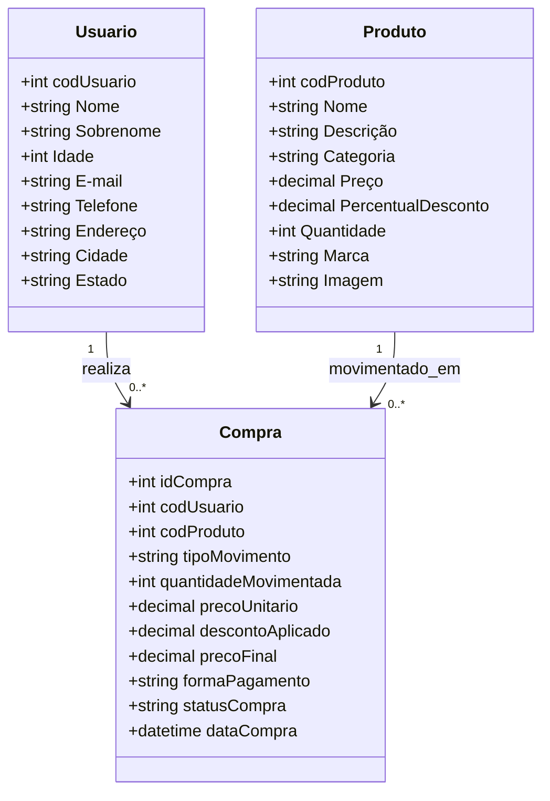
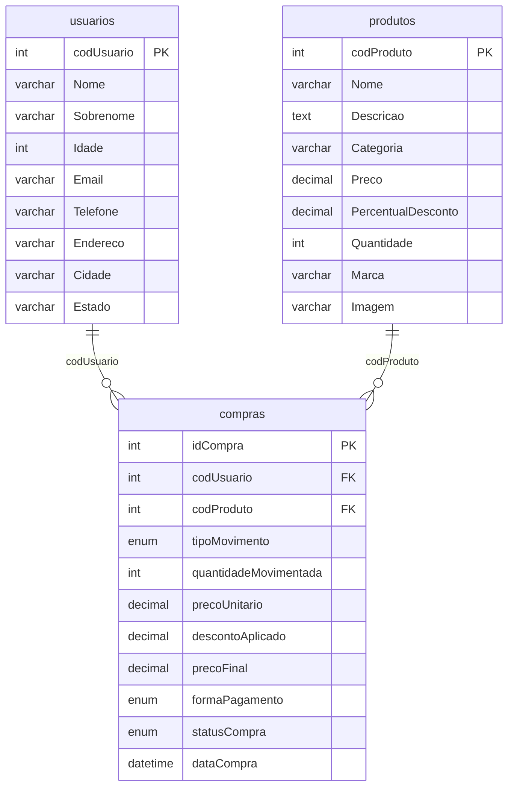

# Especificação Técnica do Sistema - Del Mercado

Este documento contém os requisitos funcionais, não funcionais, regras de negócio, lista de infraestrutura e diagramas de modelagem UML para a homologação do Sistema de Compras Interno **Del Mercado** pelo Product Owner (P.O.).

---

## 1. Requisitos do Sistema

### 1.1 Requisitos Funcionais (RF)
*   **RF-001 [CRUD Usuários]:** O sistema deve permitir o cadastro, visualização, edição e exclusão de usuários com os campos correspondentes (nome, sobrenome, idade, e-mail, telefone, endereço, cidade, estado).
*   **RF-002 [CRUD Produtos]:** O sistema deve permitir o gerenciamento do catálogo de produtos com os campos correspondentes (nome, descrição, categoria, preço, percentual de desconto, estoque, marca, imagem).
*   **RF-003 [Carga Inicial em Lote]:** O sistema deve fornecer botões de trigger para carregar em lote dados iniciais de produtos e usuários consumindo APIs externas (`dummyjson.com`) via método `bulkCreate` no ORM.
*   **RF-004 [Registrar Movimentação de Estoque]:** O sistema deve permitir o registro de movimentações do tipo ENTRADA e SAÍDA de produtos no estoque para um usuário específico.
*   **RF-005 [Validação de Estoque]:** O sistema deve impedir a finalização de movimentações do tipo SAÍDA caso a quantidade solicitada seja maior que o saldo em estoque atual daquele produto.
*   **RF-006 [Relatório Analítico de Produtos Críticos]:** O sistema deve exibir em tabela os produtos que possuem quantidade de estoque abaixo de 10 unidades.
*   **RF-007 [Relatório Analítico de Volume Financeiro]:** O sistema deve exibir em tabela o total financeiro acumulado de saídas/compras realizadas agrupadas por produto.
*   **RF-008 [Gráfico de Estoque Físico Crítico]:** O sistema deve exibir dinamicamente um gráfico de barras verticais mostrando os produtos com estoque abaixo de 10 unidades utilizando Chart.js.
*   **RF-009 [Gráfico de Volume Financeiro de Compras]:** O sistema deve exibir dinamicamente um gráfico de barras horizontais mostrando os 5 produtos com maior valor financeiro movimentado utilizando Chart.js.
*   **RF-010 [Dashboard de Produtos]:** O sistema deve apresentar os produtos cadastrados na forma de "cards" responsivos na tela inicial.

### 1.2 Requisitos Não Funcionais (RNF)
*   **RNF-001 [Arquitetura REST]:** A comunicação entre o Front-End e o Back-End deve seguir o padrão arquitetural REST (JSON via HTTP).
*   **RNF-002 [Persistência de Dados]:** O banco de dados relacional deve ser o MySQL com controle de mapeamento via ORM Sequelize.
*   **RNF-003 [Aparência e Estética]:** O design visual deve seguir uma estética dark premium inspirada no projeto Del Company (esquema de cores escuras, bordas com efeitos de glow e acentuação em vermelho `#d62828`).
*   **RNF-004 [Segurança de Dados]:** Garantia de transações atômicas no banco durante o registro de compras/movimentação de estoque (uso de Transactions do Sequelize).

---

## 2. Regras de Negócio (RN)
*   **RN-001 [Preço Final da Compra]:** O preço final de cada compra registrada deve ser calculado no backend multiplicando a quantidade movimentada pelo preço unitário do produto aplicando o percentual de desconto associado: 
    $$\text{Preço Final} = (\text{Preço Unitário} \times (1 - \frac{\text{Percentual Desconto}}{100})) \times \text{Quantidade Movimentada}$$
*   **RN-002 [Atualização Automática de Estoque]:** Cada movimentação do tipo ENTRADA deve incrementar o estoque do produto. Cada movimentação do tipo SAÍDA deve decrementar o estoque.
*   **RN-003 [Trava de Estoque Negativo]:** Nenhuma movimentação do tipo SAÍDA pode resultar em estoque de produto menor do que 0. Caso ocorra, a transação deve ser desfeita (rollback) e retornado um erro.

---

## 3. Infraestrutura do Sistema

### 3.1 Software
*   **Ambiente de Execução:** Node.js (v18+)
*   **Gerenciador de Pacotes:** NPM
*   **Framework Web Back-End:** Express (v4.19+)
*   **ORM (Object-Relational Mapping):** Sequelize (v6.37+)
*   **Driver Banco de Dados:** mysql2 (v3.9+)
*   **Banco de Dados:** MySQL (v8.0+)
*   **Bibliotecas Front-End:** Chart.js (v4.4+) para relatórios gráficos e Tailwind CSS (via CDN) para estilização.

### 3.2 Hardware (Recomendado)
*   **Processador:** Core i3 / Ryzen 3 ou superior.
*   **Memória RAM:** 8 GB RAM ou superior.
*   **Armazenamento:** 200 MB de espaço em disco livre (excluindo dados de banco dinâmico).

---

## 4. Modelagem UML

### 4.1 Diagrama de Casos de Uso (Mermaid)

```mermaid
usecaseDiagram
    actor Gestor as "Gestor / Operador"
    actor APIExterno as "API DummyJSON"
    
    Gestor --> (Gerenciar Usuários)
    Gestor --> (Gerenciar Produtos)
    Gestor --> (Registrar Movimentação de Estoque)
    Gestor --> (Visualizar Relatórios Analíticos)
    Gestor --> (Visualizar Gráficos Chart.js)
    Gestor --> (Executar Carga em Lote)
    
    (Executar Carga em Lote) ..> APIExterno : "Consome"
```

### 4.2 Diagrama de Classes UML (Mermaid)



### 4.3 Diagrama Lógico de Banco de Dados (Engenharia Reversa)


